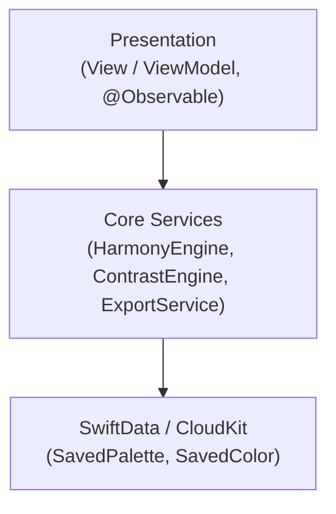

<h1 align="center">DevDesign</h1>

<p align="center">
  <strong>Offline-first iOS toolkit for designers and developers — 19 tools, AI-powered palettes.</strong><br/>
  <sub>No backend, no ads, no account required. Only the AI Palette feature touches the network.</sub>
</p>

<p align="center">
  
  
  
  
  <a href="https://sokpich.dev/devdesign"></a>
</p>

---

## Table of Contents

- [Screenshots](#screenshots)
- [Features](#features)
- [Tech Stack](#tech-stack)
- [Architecture](#architecture)
- [Folder Structure](#folder-structure)
- [Getting Started](#getting-started)
- [Testing](#testing)
- [Project Status](#project-status)
- [Roadmap](#roadmap)
- [License](#license)
- [Author](#author)

---

## Screenshots

### Dashboard

| Color & Typography | Components, Assets & AI |
|---|---|
|  |  |
| Color & typography tools on the dashboard | Components, assets, and AI palette tools on the dashboard |

### Color & Palette

| Color Picker | Palette Generator | Gradient Builder |
|---|---|---|
|  |  |  |
| HEX / RGB / HSB picker with SwiftUI export | Harmony-based palette generation | Linear and radial gradient editor |

### AI Features

| AI Palette Generator | Prompt History |
|---|---|
|  |  |
| Text-prompt palette generation via Claude, Gemini, or OpenRouter | Prompt history with saved palette snapshots |

### Typography & Tokens

| Type Scale | Font Pairing | Token Exporter |
|---|---|---|
|  |  |  |
| Modular type scale with 8 ratio presets | Google Fonts + system font pairing with live preview | Swift enum, W3C JSON, and CSS export |

### Components & Accessibility

| Component Snippets | Contrast Checker | SF Symbols | SF Symbol Detail |
|---|---|---|---|
|  |  |  |  |
| ~80 SwiftUI snippets across 10 categories | WCAG AA & AAA compliance with suggested fixes | Search and filter SF Symbols | Copy-as-SwiftUI symbol detail view |

### Layout & Spacing

| Layout Inspector | Safe Area | Spacing System |
|---|---|---|
|  |  |  |
| Padding playground with device presets | Safe area visualization | 4pt grid visualizer with comparison tool |

### Animations & Effects

| Animation Playground | Border & Decoration | Shadow Playground |
|---|---|---|
|  |  |  |
| Spring & easing curve builder with 6 preview targets | Corners, borders, glows, and overlay patterns | Multi-layer shadow builder with code export |

### Symbol Animation

| Metal Symbols | Symbol Effects |
|---|---|
| _GIF coming soon_ | _GIF coming soon_ |
| Metal shaders (shimmer, gradient flow, noise, liquid metal) applied to SF Symbols | Apple's native `.symbolEffect` animations with copyable SwiftUI output |

### Customisation

| Alternate App Icons |
|---|
| _GIF coming soon_ |
| 8 bundled icon variants switchable from inside the app |

---

## Features

### Color Tools
- **Palette Generator** — complementary, triadic, analogous, split-complementary, and tetradic harmonies
- **Color Picker** — HEX / RGB / HSB values with SwiftUI code export
- **Contrast Checker** — WCAG AA & AAA compliance with suggested passing colors
- **Saved Palettes** — persisted via SwiftData with CloudKit sync

### Typography & Spacing
- **Type Scale Generator** — 8 modular-scale ratio presets
- **Font Pairing** — Google Fonts and system fonts combined with live preview
- **Spacing System** — 4pt grid visualizer with a comparison tool
- **SF Symbols Browser** — search, category filter, and copy-as-SwiftUI

### Components & Layout
- **Shadow Playground** — multi-layer shadow builder with code export
- **Gradient Builder** — linear and radial gradient editor
- **Component Snippets** — ~80 SwiftUI snippets across 10 categories with `{{ACCENT}}` token substitution
- **Layout Inspector** — safe area, padding playground, and device presets

### Assets & Motion
- **App Icon Generator** — all 14 iOS sizes, `Contents.json`, and PNG export
- **Animation Playground** — spring & easing curve builder with 6 live preview targets
- **Metal Symbols** — shimmer, gradient flow, noise, and liquid-metal `[[stitchable]]` Metal
  shaders applied to SF Symbols via `.colorEffect` / `.distortionEffect`
- **Symbol Effects** — Apple's native `.symbolEffect` animations (bounce, pulse, variable
  color, wiggle, breathe, rotate) with copyable SwiftUI output
- **Border & Decoration** — corners, borders, glows, and overlay patterns
- **Design Token Exporter** — Swift enum, W3C JSON, and CSS custom properties

### AI Palette
- Text-prompt palette generation via Claude (Sonnet 4.5), Gemini (2.5 Flash), or OpenRouter (free Llama 3.3 70B)
- OpenRouter is the default — users generate immediately with no setup
- Structured JSON schema with name, mood, roles, and usage hints per color
- Prompt suggestion library (25 suggestions across 5 categories) and prompt history with palette snapshots
- Staggered spring color-reveal animation; save directly to Saved Palettes

### Customisation (v1.1)
- **Alternate App Icons** — 8 bundled variants (Default, Dark, Minimal, Neon, Sunset, Ocean,
  Mono, Gold) wired to `CFBundleAlternateIcons` and switchable in-app

<!-- Highlights: 19 tools in one app, fully offline except AI Palette. Zero external
     dependencies — no SPM packages, everything built on Apple frameworks. Multi-provider
     AI behind a single AIProvider protocol. @Observable + SwiftData + CloudKit stack. -->

---

## Tech Stack

| Layer | Choice |
|---|---|
| **Language** | Swift 5.9 |
| **UI** | SwiftUI (iOS 17+) |
| **State** | `@Observable` macro |
| **Architecture** | MVVM + Feature Modules |
| **Persistence** | SwiftData |
| **Sync** | CloudKit |
| **Shaders** | Metal — `[[stitchable]]` functions via SwiftUI `ShaderLibrary` |
| **Networking** | URLSession (AI Palette only) |
| **AI Providers** | Anthropic (Claude), Google Gemini, OpenRouter |
| **Font Loading** | CoreText, actor-based loader with request coalescing |
| **Image Export** | `ImageRenderer` for app icons and shareable assets |
| **Dependencies** | None — zero SPM packages |
| **Min iOS** | 17.0 |
| **Device** | iPhone only |

---

## Architecture

DevDesign follows MVVM with strict feature isolation — every feature owns its own `View`,
`ViewModel`, and tests folder under `Features/`. There is no shared mega-ViewModel and no tab
bar; a single dashboard grid in `ContentView` routes to each feature.



**Key decisions**
- Every feature under `Features/` owns its `View`, `ViewModel`, and tests — no shared mega-ViewModel.
- No tab bar; a single dashboard grid in `ContentView` routes to each tool.
- State is managed with the `@Observable` macro (Swift 5.9), not Combine.
- Multi-provider AI sits behind one `AIProvider` protocol so Claude/Gemini/OpenRouter are interchangeable.

---

## Folder Structure

```
DevDesign/
├── App/                    # App entry point, ContentView dashboard grid
├── Core/                   # HarmonyEngine, ContrastEngine, ExportService, shared utilities
├── DesignSystem/           # Shared design tokens and reusable UI primitives
├── Features/               # One folder per tool (View + ViewModel + tests), e.g.
│                            # PaletteGenerator/, ColorPicker/, ContrastChecker/, TypeScale/,
│                            # FontPairing/, SpacingSystem/, SFSymbols/, ShadowPlayground/,
│                            # GradientBuilder/, ComponentSnippets/, LayoutInspector/,
│                            # AppIconGenerator/, AnimationPlayground/, MetalSymbols/,
│                            # SymbolEffects/, BorderDecoration/, DesignTokenExporter/,
│                            # AIPalette/, AppIconPicker/
├── DevDesignTests/          # ~771 unit tests across 21 feature files
└── DevDesignUITests/
```

---

## Getting Started

### Requirements
- macOS with Xcode 15+
- iOS 17+ Simulator or device
- No third-party dependencies to install

### Clone
```bash
git clone https://github.com/sokpichdev/DevDesign.git
cd DevDesign
open DevDesign.xcodeproj
```

Select your development team in **Signing & Capabilities**, then build and run.

### AI Palette Setup (optional)

The AI Palette feature supports three providers. OpenRouter works out of the box with no API key.

| Provider | Model | Key Required |
|---|---|---|
| OpenRouter | Llama 3.3 70B (free) | No |
| Claude | Sonnet 4.5 | Yes — [console.anthropic.com](https://console.anthropic.com/settings/keys) |
| Gemini | 2.5 Flash | Yes — [aistudio.google.com](https://aistudio.google.com/app/apikey) |

---

## Testing

```bash
xcodebuild test -scheme DevDesign -destination 'platform=iOS Simulator,name=iPhone 15'
```

- **Coverage:** ~771 unit tests across 21 feature files in `DevDesignTests/`, plus `DevDesignUITests/`.

---

## Project Status

✅ Stable — all 19 tools and the AI Palette feature are shipped, with ~771 unit tests across 21
feature files.

---

## Roadmap

- [x] 19 core tools + AI Palette shipped
- [x] Metal Symbols and Symbol Effects (v1.1)
- [x] Alternate app icons (v1.1)
- [ ] Record demo GIFs for Metal Symbols, Symbol Effects, and the app icon picker
- [ ] Additional AI providers
- [ ] Additional export formats

---

## License

[MIT](LICENSE) © 2026 Sok Pich

---

## Author

**Sok Pich** — [@sokpichdev](https://github.com/sokpichdev) · [sokpich.dev/devdesign](https://sokpich.dev/devdesign)

<sub>iOS 17+ · iPhone only · Offline-first</sub>
